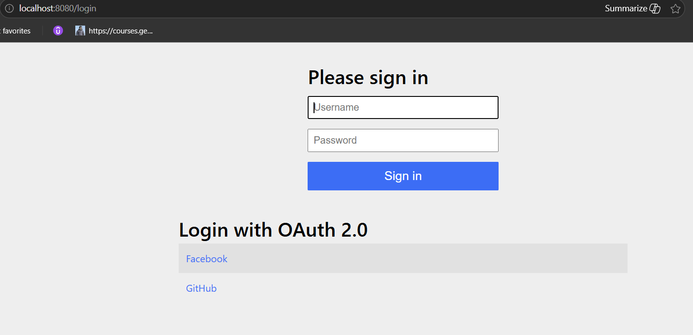

# Spring Security OAuth2 Login Example

A Spring Boot application demonstrating authentication using Spring Security Form Login and OAuth2 Login with GitHub and Facebook.

## Features

- Form-based authentication
- OAuth2 Login with GitHub
- OAuth2 Login with Facebook
- Protected endpoints using Spring Security
- Custom OAuth2 success URL
- Authentication type inspection using Spring Security

## Technologies Used

- Java
- Spring Boot
- Spring Security
- OAuth2 Client
- Maven

## Application Flow

1. User accesses the protected `/secure` endpoint.
2. Spring Security redirects the user to the login page.
3. User can authenticate using Form Login, GitHub, or Facebook.
4. After successful OAuth2 authentication, the user is redirected to `/home`.
5. The application identifies the authentication type and returns the secured response.

---

## Screenshots

### Spring Security Login Page




The default login page generated by Spring Security. Users can authenticate using username/password or choose an OAuth2 provider such as GitHub or Facebook.

### GitHub Authorization Page


After selecting GitHub Login, the user is redirected to GitHub's consent screen. GitHub displays the application information and asks the user to authorize access.

### GitHub Sign In Page


If the user is not already signed in to GitHub, GitHub displays its login page. After successful authentication, GitHub redirects the user back to the application.

---

## Security Configuration

### Secured Endpoint

```text
/secure
```

Requires authentication.

### Public Endpoints

All other endpoints are accessible without authentication.

### OAuth2 Providers

- GitHub
- Facebook

### Success URL

```text
/home
```

---

## API Endpoints

| Endpoint | Description |
|-----------|------------|
| /secure | Protected endpoint requiring authentication |
| /home | Welcome page displayed after successful login |

---

## Authentication Types

The application supports two authentication mechanisms:

### Form Login

```java
UsernamePasswordAuthenticationToken
```

### OAuth2 Login

```java
OAuth2AuthenticationToken
```

The `/secure` endpoint inspects the Authentication object and determines which authentication mechanism was used.

---

## Project Structure

```text
src
 └── main
     └── java
         ├── SecurityConfig.java
         └── Controller.java
```

### SecurityConfig

Responsible for:

- Security rules
- Form Login configuration
- OAuth2 Login configuration
- OAuth2 client registrations

### Controller

Responsible for:

- Handling secured requests
- Reading authentication details
- Returning application responses

---

## Run the Application

```bash
mvn spring-boot:run
```

Open:

```text
http://localhost:8080/secure
```

to test the authentication flow.

---

## Learning Objectives

This project demonstrates:

- Spring Security fundamentals
- OAuth2 Authorization Code Flow
- Client Registration configuration
- OAuth2 Login integration
- Authentication handling in Spring Boot applications
